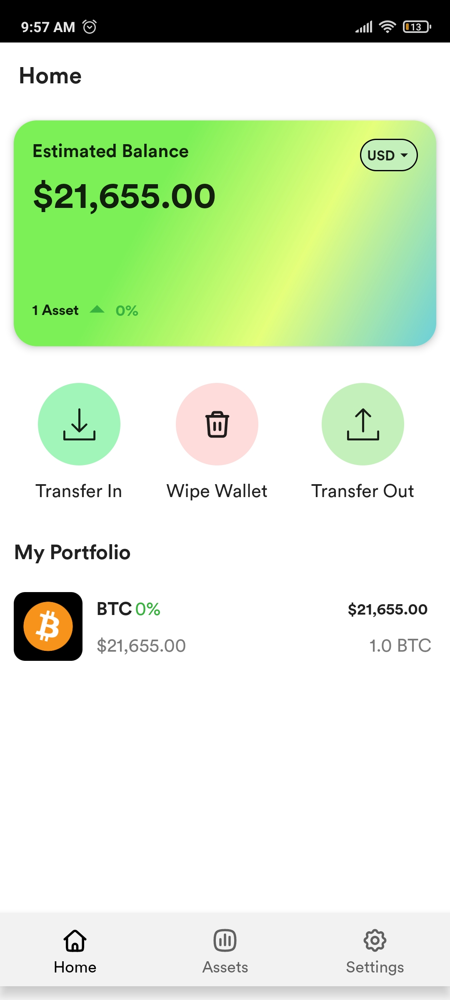
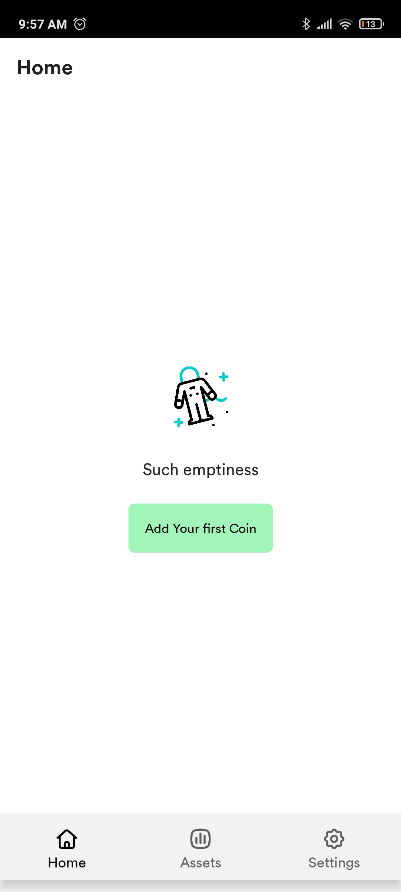
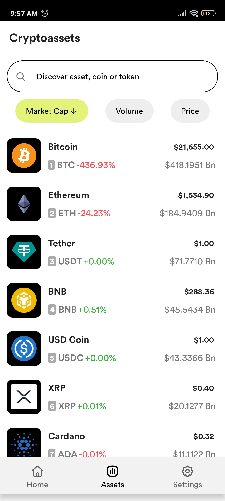
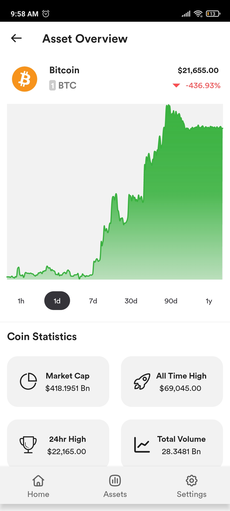
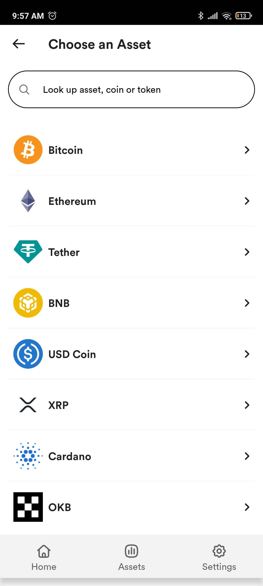
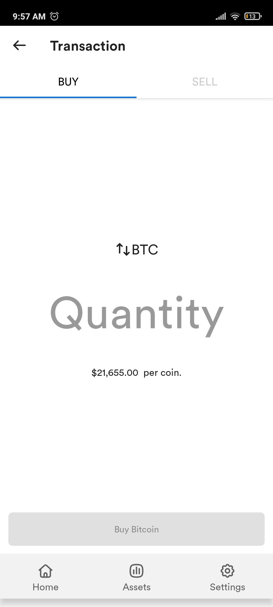
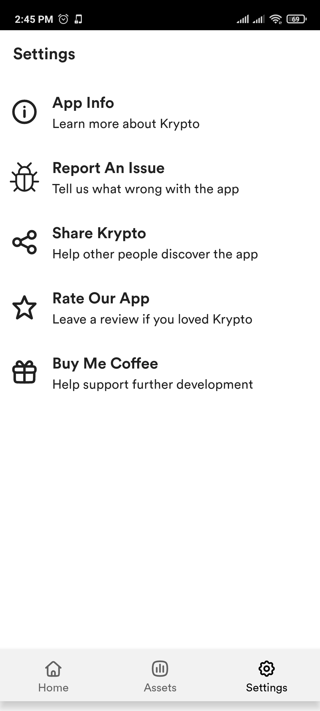
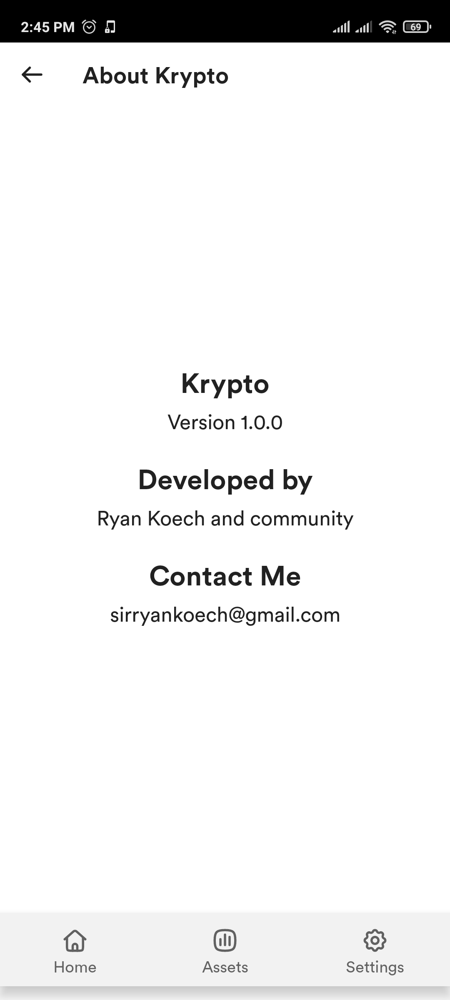

<!-- PROJECT SHIELDS -->
<!--
* I'm using markdown "reference style" links for readability.
* Reference links are enclosed in brackets [ ] instead of parentheses ( ).
* See the bottom of this document for the declaration of the reference variables
* for contributors-url, forks-url, etc. This is an optional, concise syntax you may use.
* https://www.markdownguide.org/basic-syntax/#reference-style-links
-->
[![Contributors][contributors-shield]][contributors-url]
[![Forks][forks-shield]][forks-url]
[![Stargazers][stars-shield]][stars-url]
[![Issues][issues-shield]][issues-url]
[![MIT License][license-shield]][license-url]


**WIP - First release coming soon.**

# Krypto

> Monitor various crypto assets and perform mock purchases to test your crypto skills from the safety and comfort of your phone.

## Technologies

> Native application developed using the **Kotlin** programming language.

Below are some of the key android concepts used/applied in this project:

- Clean Architecture
- Jetpack compose
- Feature multi-modularization
- Room Database
- Retrofit / OkHttp
- Dagger-Hilt
- Shared preferences
- etc

### Main Project Features
Each feature is will comprise of 3 layers; presentation, domain, data 

- Home Feature 
- Transaction Feature 
- Coin List Feature
- Coin Details Feature
- Setting Feature

## App Screenshots

### Light
   
  
 

### Dark
_Coming Soon_

## UI Designs
Link to app UI designs [here](./UiDesigns.md)


## Getting Started

To get a local copy up and running follow these simple example steps.

```bash
# Clone Repo
git clone https://github.com/RyanKoech/android-krypto.git

# Make setup script executable
chmod +x setup.sh

# Run setup script (Linux) a bat file exists for windows systems as well
./setup.sh

# Build Debug Apk
./gradlew assembleDebug
```

### Prerequisites
Installed Android Studio or Any other android development IDEs and their respective dependencies.

## 🤝 Contributing

Contributions, issues, and feature requests are welcome! <br/>
You can pick a thing to do from the [issues page](../../issues) and work on it. I will be raise more soon. <br/>

### i. Branching

#### General
Observe the following in order to have your PR merged successfully.
- Create **branches from the `dev` branch** of your forked repo.
- Create a **PR to the `dev` branch**
- Prefix **branch name** with its **issue label then issue number** of the most significant issue being solved ie `bug/21`, `ui/23`, `enhancement/45`. This means you need to have an issue open before you can work on a contribution. Where an issue has several labels, choose branch name in order of precedence, `enhancement > bug > ui > testing > documentation`.
- Fix the least number of issues per PR. Best, **1 issue per PR**. Else, tag any other issue solved in the PR.

#### Branch Naming Format
`<issue type>/<issue number>`

### ii. Pull Request

#### General
Observe the following in order to have your PR merged successfully.
- Ensure an issue is open for the pull request you made.

#### Pull Request Naming Format
`<issue type>-<issue number> :: <PR description (Typically same as issue name)>`

### iii. Commits

#### General
Observe the following in order to have your PR merged successfully.
- Ensure your commit messaged accurately describe the changes made

#### Commit Message Format
`<issue type>-<issue number> :: <commit message>`


Feel free to check the [issues page](../../issues/) or [discussions page](../../discussions).

## Show your support

Give a ⭐ if you like this project!

## Acknowledgments

- [Brian Njogu](https://brayo.co/) - original ideator of Krypto and developer of the react native version

## 📝 License

This project is [MIT](./LICENCE) licensed.


<!-- MARKDOWN LINKS & IMAGES -->
<!-- https://www.markdownguide.org/basic-syntax/#reference-style-links -->
[contributors-shield]: https://img.shields.io/github/contributors/RyanKoech/android-krypto.svg?style=for-the-badge
[contributors-url]: https://github.com/RyanKoech/android-krypto/graphs/contributors
[forks-shield]: https://img.shields.io/github/forks/RyanKoech/android-krypto.svg?style=for-the-badge
[forks-url]: https://github.com/RyanKoech/android-krypto/network/members
[stars-shield]: https://img.shields.io/github/stars/RyanKoech/android-krypto.svg?style=for-the-badge
[stars-url]: https://github.com/RyanKoech/android-krypto/stargazers
[issues-shield]: https://img.shields.io/github/issues/RyanKoech/android-krypto.svg?style=for-the-badge
[issues-url]: https://github.com/RyanKoech/android-krypto/issues
[license-shield]: https://img.shields.io/github/license/RyanKoech/android-krypto.svg?style=for-the-badge
[license-url]: https://github.com/RyanKoech/android-krypto/blob/master/LICENCE
