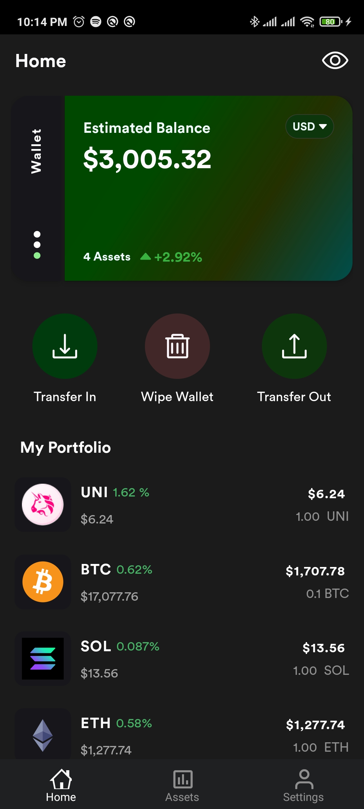

<!-- PROJECT SHIELDS -->
<!--
* I'm using markdown "reference style" links for readability.
* Reference links are enclosed in brackets [ ] instead of parentheses ( ).
* See the bottom of this document for the declaration of the reference variables
* for contributors-url, forks-url, etc. This is an optional, concise syntax you may use.
* https://www.markdownguide.org/basic-syntax/#reference-style-links
-->
[![Contributors][contributors-shield]][contributors-url]
[![Forks][forks-shield]][forks-url]
[![Stargazers][stars-shield]][stars-url]
[![Issues][issues-shield]][issues-url]
[![MIT License][license-shield]][license-url]


# Krypto

> Monitor various crypto assets and perform mock purchases to test your crypto skills from the safety and comfort of your phone.

## Technologies

> Native application developed using the **Kotlin** programming language.

Below are some of the key android concepts used/applied in this project:

- Clean Architecture
- Jetpack compose
- Feature multi-modularization
- Room Database
- Retrofit / OkHttp
- Dagger-Hilt
- Shared preferences
- etc

### Main Project Tasks
Each feature is will comprise of 3 layers; presentation, domain, data 

- [ ] Home Feature 
- [ ] Transaction Feature 
- [ ] Coin List Feature
- [ ] Coin Details Feature
- [ ] Setting Feature

## UI Designs

### Light
   
  
  
  
 

### Dark
   
  
   
   
 

## Getting Started

To get a local copy up and running follow these simple example steps.

```bash
git clone https://github.com/RyanKoech/android-krypto.git
```

### Prerequisites
Installed Android Studio or Any other android development IDEs and their respective dependencies.

## 🤝 Contributing

Contributions, issues, and feature requests are welcome! <br/>
You can pick a thing to do from the tasks list provided above and work on it.<br/>

Observe the following in order to have your PR merged successfully.
- Create branches from the `dev` branch
- Create a PR to the `dev` branch
- Prefix branch name with it purpose ie `feature_`, `bugfix_`, `hotfix_`
- For feature branches use the following naming conventions `feature_<feature-name>`

Feel free to check the [issues page](../../issues/) or [discussions page](../../discussions).

## Show your support

Give a ⭐ if you like this project!

## Acknowledgments

- [Brian Njogu](https://brayo.co/) - original ideator of Krypto and developer of the react native version

## 📝 License

This project is [MIT](./MIT.md) licensed.


<!-- MARKDOWN LINKS & IMAGES -->
<!-- https://www.markdownguide.org/basic-syntax/#reference-style-links -->
[contributors-shield]: https://img.shields.io/github/contributors/RyanKoech/android-krypto.svg?style=for-the-badge
[contributors-url]: https://github.com/RyanKoech/android-krypto/graphs/contributors
[forks-shield]: https://img.shields.io/github/forks/RyanKoech/android-krypto.svg?style=for-the-badge
[forks-url]: https://github.com/RyanKoech/android-krypto/network/members
[stars-shield]: https://img.shields.io/github/stars/RyanKoech/android-krypto.svg?style=for-the-badge
[stars-url]: https://github.com/RyanKoech/android-krypto/stargazers
[issues-shield]: https://img.shields.io/github/issues/RyanKoech/android-krypto.svg?style=for-the-badge
[issues-url]: https://github.com/RyanKoech/android-krypto/issues
[license-shield]: https://img.shields.io/github/license/RyanKoech/android-krypto.svg?style=for-the-badge
[license-url]: https://github.com/RyanKoech/android-krypto/blob/master/LICENSE
